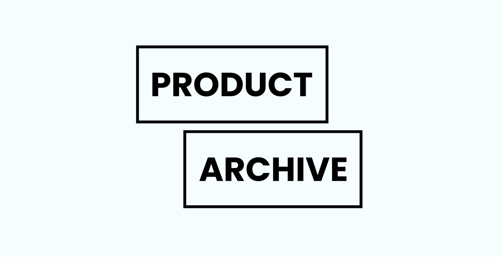

# Product Archive

##  Getting started
### **Impostare l'enviroment**

Copiare il file `.env.example` e rinominare il nuovo file `.env`. Da questo file è possibile personalizzare le variabili d'ambiente. Per esempio, se si ha bisogno di eseguire `json-server` in una porta diversa, si può impostare `JSON_SERVER_PORT` su un valore diverso, per esempio:

```
JSON_SERVER_PORT=3001
REACT_APP_API_URL=http://localhost:3001
```

### **Lanciare l'applicazione**
Bisogna eseguire due commandi: 
```
npm start
```
```
npm run jsonServer
```

> ⚠️ Attenzione 
> il commando `npm run jsonServer` prende come riferimento la porta 7000 per lanciare json-server, se hai cambiato essa nel tuo `.env` locale, dovrai cambiare anche questo commando all'interno del `package.json`


### **Testing**

#### `npm run test`
Lancia tutti i test

#### `npm run test:coverage`
Lancia tutti i test e mostra il coverage

### **Coverage totale**

File                                                 | % Stmts | % Branch | % Funcs | % Lines |
-----------------------------------------------------|---------|----------|---------|---------|
All files                                            |   90.51 |    51.85 |   88.09 |   90.96 |  

Puoi trovare il coverage dell'ultimo commit [qui](https://github.com/lucacacciarru/product-archive/actions/runs/2352681535)

### **Documentazione inerenti alle implementazioni eseguite**
- [Store management](docs/storeManagment.md)
- [Sistema di filtraggio](docs/filtering.md)
- [Implementazioni in un caso reale](docs/futureChange.md)
