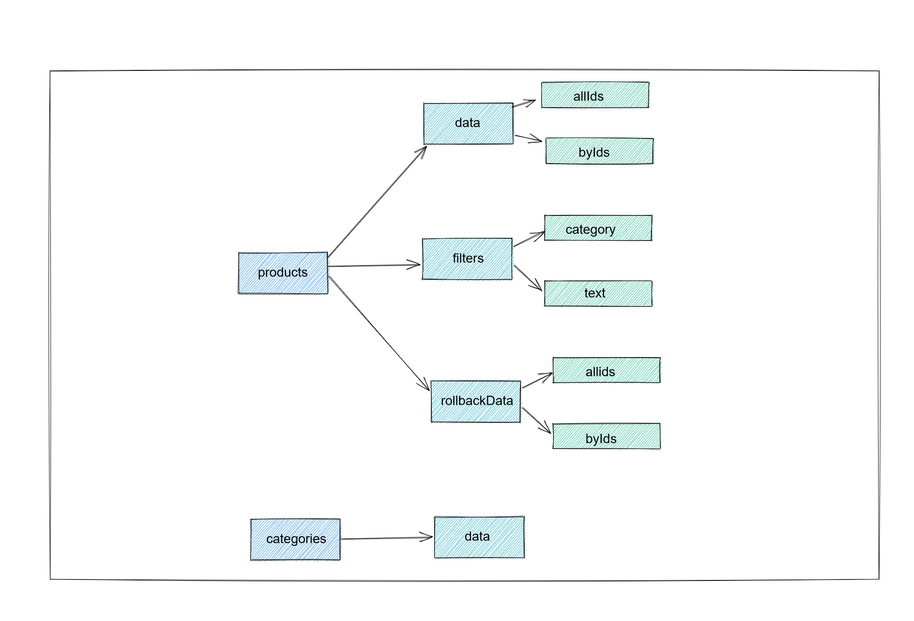

# Store management

### Panoramica generale

Per la gestione dello stato ho scelto di utilizzare `redux` e per le computazioni asincrone `redux-saga`, in modo tale che da poter gestire tutti gli stati in maniera efficente.
La struttura dello stato è la seguente:



Lo store è popolato da due slice, quello dei products e delle categories, che tramite operazioni asincrone con redux saga verso un json-sever.

### Product state

All'interno della slice Product abbiamo un oggetto data che al suo interno contiene `allIds` e `byId`, esso è strutturato in questa maniera per creare un [state normalizzato](https://redux.js.org/usage/structuring-reducers/normalizing-state-shape), come è anche presente nella documentazione di Redux. allIds si tratta di un array degli id degli elementi che saranno presenti, mentre su byId abbiamo un record di id e ggetti Product dove sono presenti tutte le informazioni di cui abbiamo bisogno. pEr comprendere al meglio la struttura, questa è la tipizzazione dello state:

```
export  type  ProductsData  =  {
allIds:  string[];
byId:  Record<string,  Product>;
};

export  type  Filters  =  {
text:  string;
category:  string;
};

export  type  ProductState  =  {
data:  ProductsData;
rollbackData?:  ProductsData;
filters:  Filters;
};
```

In questa maniera la logica di recupero, l'aggiornamento o l'inserimento di un elemento è molto più semplice è strutturata, inserendo pochissima logica all'interno degli state. In questa maniera possiamo utilizzare, in questo caso, `byId` come una **cache**, è renderizzare solo gli elementi contenuti in `allIds` all'interno della nostra applicazione, ciò accade ad esempio quando filtriamo gli elementi.

All'interno dell'attributo filters saranno presenti due stringhe che sono quelle inerenti alla ricerca e filtraggio degli elementi.

Sempre all'interno di questo state è presente `rollbackData`, è dello stesso tipo di data ed è facoltativo, verrà utilizzato nel momento in cui si eseguono operazioni di creazione/modifica/rimozione per **conservare** il valore precedente in caso sia necessario un **ripristino**, ad esempio quando una chiamata all'api andrà in failure. Ciò è stato fatto per avere un **[Optimistic UI](https://medium.com/vlk-studio/optimistic-ui-for-dummies-teoria-a76cc5dd584d)**, ovvero per avere un gestione ottimistica dello stato, in modo da migliorare la _User Experience_ e dare un riscontro immediato a determinata azioni sincrone che l'utente andrà ad effettuare.
In questa maniera, quando si andranno a triggerare determinate action (come quelle di updateProduct) tramite le saga verrà effettuato il seguente processo:

1.  Si effettua la richiesta al server di modifica del prodotto
2.  Cominciare a modificare la stato mettendo su **data** la modifica proposta, ma salvare la vecchia configurazione su **rollbackData**;
3.  Se ottengo risposta positiva dalla richiesta svuoto semplicemente **rollbackData**.
4.  Se invece ricevo esito negativo dal server, **ripristino** l’attributo data attraverso **rollbackData**.

#### Gestione azioni asincrone

Tutte le funzioni asincrone all'interno delle saga sono formate da quattro action:

- Trigger: action che verrà utilizzata per lanciare la saga dove vengono dispatchate le altre action
- Request: Solitamente utilizzate per creare un'istanza di data all'interno di rollbackData e insire il valore creato in local in caso di Optimistic UI
- Success: Quando la chiamata all'api va in success, se è presente una response verrà inserito all'interno di data tramite il reducer annesso
- Failure: Utilizzata quando la chiamata all'api va in failure, viene risettato il valore originario di data (se è stato modificato in base all'Optimistic UI) che è contenuto in rollbackData. Subito dopo quest'ultimo sarà svuotato.

Per poter capire al meglio questo funzionamento questo è l'esempio di una saga:

```
export  function*  updateProductSaga(action:  UpdateProductAction)  {
yield  put(updateProductRequest(action.payload));
try  {
yield  call(updateProductApi,  action.payload);
yield  put(updateProductSuccess());
}  catch (error) {
yield  put(updateProductFailure());
}
}
```

Tramite un _generatore_ viene lanciata la request e subito dopo l'api, che se andrà in success dispatchera la success o, in caso contrario, la failure.
Questa saga verrà lanciata quando una determinata trigger (o qualsiasi azione noi decidiamo) verrà dispatchata, ad esempio:

```
export  function*  productRootSaga()  {
yield  takeLatest(fetchProductTrigger,  fetchProductSaga);
yield  takeLatest(createProductTrigger,  createProductSaga);
yield  takeLatest(updateProductTrigger,  updateProductSaga);
yield  takeLatest(createProductSuccess,  fetchProductSaga);
yield  takeLatest(fetchSingleProductTrigger,  fetchSingleProductSaga);
yield  takeLatest(updateFilters,  fetchOnUpdateFilters);

yield  put(fetchProductTrigger());

}
```

#### PS:

All'interno di `productRootSaga` si può notare `yield put(fetchProductTrigger());` ciò è stato fatta per dispatchare subito la action di trigger e quindi anche il suo worker `fetchProductSaga` in modo da lanciare la richiesta all'api appena l'applicazione viene lanciata.

### Categories state

Come in un caso reale ho voluto inserire le verie categorie dei prodotti all'interno del database per poterle fetchare e ottenere facilmente, in modo tale da utilizzarle quando andiamo a filtrare i prodotti. Sempre con la stessa logica delle operazioni asincrone mostrate per il Product State

## Alternative per le operazioni asincrone

Ho voluto scegliere questa opzione di Redux Saga per utilizzare le sue potenzialità al meglio in questo contesto, però si può benissimo notare che il boilerplate è molto elevato per quanto riguarda la gestione dello stato, tra action, reducer, selector e saga. Una soluzione per sopperire a ciò è [RTK-QUERY](https://redux-toolkit.js.org/rtk-query/overview), che ci permette di creare facilmente le slice e attuare opzioni asincrone in maniera veloce e con pochissima quantità di codice. Ad esempio, per creare tutte la logica per fetchare e fare una richiesta per aggiungere prodotti sarebbe bastato ciò:

```
export  const productApi =  createApi({
	reducerPath:  "product",
	baseQuery:  fetchBaseQuery({  baseUrl: process.env.REACT_APP_API_URL }),
	tagTypes: ["Product"],
	endpoints:  (builder)  => ({
		getProduct: builder.query<Product[],  void>({
			query:  ()  =>  "/products",
			providesTags: ["Product"],
		}),
		postProduct: builder.mutation<Product,  Partial<Product>>({
			query:  (body)  => ({
				url:  "products",
				method:  "POST",
				body,
		}),
			invalidatesTags: ["Product"],
		}),
	}),
});

export  const  { useGetProductQuery, usePostProductMutation }  = productApi;
```

Attraverso gli hook restituiti possiamo effettuare tali azioni in maniera semplice al'interno dei nostri componenti o in qualsiasi punto dell'applicazione. L'utilizzo di questa libreria non esclude Saga, perché potremmo utilizzare facilmente entrambe assieme.
